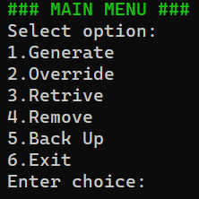

<p align="center">
  <h1 align="center">SecureKey</h1>
</p>



1. [Introduction](#introduction)
2. [Description](#description)
   - [Functionality](#functionality)
   - [Windows Deploy](#windows-deploy)
   - [Development Notes](#development-notes)
3. [Author](#author)
4. [Version History](#version-history)
5. [License](#license)
6. [Roadmap](#roadmap)

## Introduction

SecureKey is a password management application that allows you to store and protect your passwords securely.

With SecureKey, you can conveniently and securely create, edit, delete, and access your passwords.

The application will use advanced encryption algorithms to safeguard your passwords and ensure the confidentiality of your data.

## Description

SecureKey is a powerful password manager designed to simplify your digital life while ensuring the security of your sensitive information. With SecureKey, you can securely store, manage, and retrieve all your passwords in one place.

The intuitive console interface make password management effortless and worry-free. Say goodbye to password-related stress and welcome a seamless experience with SecureKey.

### Functionality

1. When the program is executed, a welcome message with relevant information is displayed, and the system is loaded.

2. Once the program loads, the user is presented with a main menu with options to create, view, edit, and delete passwords , create and restore backups or exit the program.

3. When selecting the option to create passwords, the user is prompted to enter the name and lenght, then a random password of given lenght is generated and stored.

4. When selecting the option to view passwords, all passwords stored are displayed.

5. When selecting the option to edit passwords, the user is allowed to select and modify the passwords stored.

6. When selecting the option to delete passwords, the user is allowed to select and remove the passwords stored.

7. Backups prompts a menu to generate and store or retrive backups of stored passwors.

8. The user can exit the program by selecting the corresponding option.

In summary, "SecureKey" is an application that provides users with a convenient way to store and access their passwords, avoiding the need to remember multiple passwords or write them down in insecure places.

### Windows Deploy

1. Install PyInstaller (assuming Python and pip are already installed):

To install PyInstaller, open the Command Prompt on your Windows computer and type the following command:

```
pip install pyinstaller
```

This will download and install PyInstaller on your system.

2. Navigate to where securekey.py is located:

Use the cd command in the Command Prompt to navigate to the directory where securekey.py is located. For example:

```
cd C:\Users\yourname\Downloads
```

Replace C:\Users\yourname\Downloads with the actual path to the directory containing securekey.py.

3. Create a one-file compilation using PyInstaller:

To create a one-file compilation of securekey.py, use the following command in the Command Prompt:

```
pyinstaller --onefile securekey.py
```

PyInstaller will analyze the script, bundle it with the necessary dependencies, and create a standalone executable. The executable will be saved in a new directory called dist, which will be created in your folder.

For example, the one-file executable will be located at:

```
C:\Users\yourname\Downloads\dist
```

That's it! You have now created a one-file compilation of SecureKey. The executable can now be found in the dist folder inside your working directory, and you can run it on compatible systems without needing Python or any external dependencies.

### Development Notes

This project was developed under Windows 11 22H2 (Build 22621.1992), Visual Studio Code 1.80.1, Python 3.11.3, pip 23.2.1, and PyInstaller 5.13.0.

Also, the program relies on the following packages: errno, os, pyperclip, random, shutil, sys, and time. These packages are included in the requirements.txt file.

## Author

Matias Martin Murad Pretz (https://matipretz.github.io/)

## Version History

- 0.1
  - Initial version.

## License

This project is licensed under the MIT License - see the LICENSE.md file for more details.

## Roadmap

Although this program is single-user without advanced features such as online access from multiple devices, it is desirable for the future to turn it into a cloud service that allows overcoming this difficulty.
